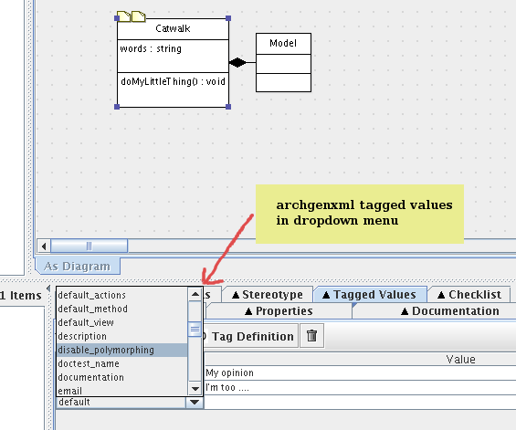

============
Installation 
============

ArchGenXML has a dependency on some zope 3 eggs. To not mess up your global site-packages directory, using buildout or virtualenv is recommended.

Note: In an older version of AGX, a Zope 3 installation could be configured in a *~/.agx_zope_path* file. This case is not supported anymore. You can delete this file if you have it.

On Windows, I assume you installed Python 2.4.4 from the `msi installer`_ and installed it in the default location. If you have not already done, configure the Path environment variable to include your python path and scripts directory.
For this, got to Control Panel, Advanced, Environment Variables, edit Path, append ``;C:\\Python24;C:\\Python24\Scripts`` to the existing string.

.. _`msi installer`: http://www.python.org/download/releases/2.4.4/

Installing stable version
=========================
Attention: adding archgenxml egg to a Plone buildout is not supported!
Plone 3.x buildout is shipped with old Zope 3.3. ArchGenXML depends on latest version of zope 3 eggs. So please create a buildout only for archgenxml like described below.

If you want to install archgenxml via buildout (recommended), read *Using buildout* and skip the *Using easy_install in a virtualenv* part.

It can happen ArchGenXML version on plone.org is older than Pypi because the release manager forgot to upload it on plone.org or for another reason. easy_install and buildout will get by default the latest ArchGenXML version on Pypi, so it's fine.

Using buildout
--------------
Create a fresh directory and go into it::

    $ mkdir archgenxml_buildout
    $ cd archgenxml_buildout

Download the normal bootstrap.py_ and put it in this directory. You can copy an existing bootstrap.py file of one of your buildout, it's the same file.

Then create a `buildout.cfg` file in this directory with the following snippet::

    [buildout]
    parts = 
        archgenxml
        
    [archgenxml]
    recipe = zc.recipe.egg:scripts
    eggs = archgenxml

.. _bootstrap.py: http://svn.zope.org/*checkout*/zc.buildout/trunk/bootstrap/bootstrap.py

Finally bootstrap the buildout and run it::

    $ python bootstrap.py 
    $ ./bin/buildout

On Windows, it's ``bin\buildout``, you have to replace '/' by '\\' in all following examples.

archgenxml is now available in ``./bin/archgenxml``.

To update archgenxml later, go in your directory and run buildout again::

    $ ./bin/buildout

It will download latest version of archgenxml all all its dependencies.

I call below *<path to archgenxml>* the archgenxml_buildout directory.

Using easy_install in a virtualenv
----------------------------------
If you don't want to use buildout, you can use virtualenv to create an isolated environment.
You have to install setuptools egg to have the easy_install command available.
On Ubuntu you can do it with ``apt-get install python-setuptools``.
On Windows, go to the `setuptools pypi page`_, download the exe which match the Python version you are using and execute it to install it.

.. _`setuptools pypi page`: http://pypi.python.org/pypi/setuptools

Install virtualenv with easy_install::

    $ easy_install virtualenv

On Windows easy_install.exe is in ``C:\Python24\Scripts``, so you have to invoke it with the full path if you don't have added this directory in your PATH.

Create the virtualenv with --no-site-packages option to not see packages installed globally::

    $ virtualenv --no-site-packages agx
    $ cd agx/
    $ source bin/activate
    $ easy_install archgenxml

Everytime you want use archgenxml, you have to go in the *agx* directory and type ``source bin/activate`` to activate the environment. To deactivate the environment, type ``deactivate``.

To update archgenxml, you have to update each egg, the most important one are archgenxml and xmiparser::

    $ easy_install -U archgenxml
    $ easy_install -U xmiparser

If you have a problem with archgenxml, please be sure to recreate the virtualenv completly so you have latest versions of all eggs before asking on the archetypes-users mailing-list.

I call below *<path to archgenxml>* the path to the virtualenv agx directory.

Installing development version
==============================
ArchGenXML's svn trunk is for the 2.x development version. 

As usual, the goal is to keep trunk workable. Some of the developers
work and develop on the edge: trunk. 

If you need stability, use the latest release.

The only supported way to use ArchGenXML trunk is with buildout.
You install it like this::

    $ svn co https://svn.plone.org/svn/archetypes/ArchGenXML/buildout archgenxml_buildout
    $ cd archgenxml_buildout
    $ python bootstrap.py
    $ bin/buildout

To update your buildout::

   $ cd archgenxml_buildout
   $ svn up
   $ bin/buildout

If you are intersted in AGX 3 development, see http://dev.plone.org/archetypes/browser/AGX

I call below *<path to archgenxml>* the archgenxml_buildout directory.

Get the ArchGenXML profile
==========================
The archgenxml_profile.xmi file contains information about stereotypes, fields, and other stuff that AGX needs to generate valid Python code from your model. 
You can `get the profile`_ from subversion.

.. _`get the profile`: http://svn.plone.org/svn/archetypes/ArchGenXML/trunk/umltools/argouml/archgenxml_profile.xmi

Or you can regenerate it with `<path to archgenxml>/bin/agx_argouml_profile`.
A archgenxml_profile.xmi file is generated in the current directory.

Create a "<path to archgenxml>/profiles" directory and put the file here.

Note: In an older version of AGX, this file was called 'argouml_profile.xmi'. You should not use it with ArgoUML > 0.24.

Troubleshooting
===============
On Windows, you may have to install and configure the `mingw32 compiler`_ to compile the zope.proxy egg, an indirect dependency of archgenxml. Now zope.proxy eggs are built for Windows, so you should not have this problem anymore.

Support
=======
For any questions or problems, please ask on the `archetypes-users mailing-list`_.
Please don't use comments on the manual pages. Not everybody is alerted when a comment is added.

If you want to contribute to this documentation, please post on the `plone-docs mailing-list`_.

.. _`mingw32 compiler`: http://plone.org/documentation/how-to/using-buildout-on-windows
.. _`archetypes-users mailing-list`: http://plone.org/support/forums/archetypes
.. _`plone-docs mailing-list`: http://plone.org/support/forums/docs

===============================================
Configure ArgoUML to use the archgenxml profile
===============================================

Background and Notes
====================
The screenshot below shows ArgoUML with the custom tags from the definition 
file. Having many of the possible options available from a menu has the 
following benefits:
 
* saves time - sometimes clicking is faster  than typing
* reduces errors - no more mispelled tags
* presents a learning opportunity - seeing new tags and stereotypes provides a 
  springboard for further investigation

    ArgoUML with ArchGenXML profile

This walks you through how a setup of ArgoUML on an Ubuntu desktop system.
The methodology should be easily adjusted to other platforms.

Assumptions
===========
These are my assumptions:

* You already have latest sun java JRE installed.
  You can get it on Ubuntu with::
  
    apt-get install sun-java6-jdk

  If::
   
    update-alternatives --list java
  
  don't give you */usr/lib/jvm/java-6-sun/jre/bin/java*, you can set java sun as the default java implementation like this::
  
    update-alternatives --set java /usr/lib/jvm/java-6-sun/jre/bin/java

* You have copied archgenxml_profile.xmi in the *<path to archgenxml>/profiles* directory like described in the previous section.

Install ArgoUML
===============
Go to http://argouml.tigris.org and download the latest stable version of ArgoUML (0.28 when these lines are written).
Download the exe for Windows, the tar.gz archive for Linux.

On Windows, execute the downloaded exe to install it.

On Linux, unpack the archive somewhere, a good location is '/opt'::

  $ sudo mkdir /opt
  $ cd /opt
  $ sudo tar xvf /tmp/ArgoUML-0.28.tar.gz

It should create a argouml-0.28 directory.

It is handy to symlink 'argouml.sh' to '/usr/local/bin/argouml'::

  $ sudo ln -s /opt/argouml-0.28/argouml.sh /usr/local/bin/argouml

Configure ArgoUML to use the definition file
============================================
Note: ArgoUML 0.24 used to use the argo.defaultModel option to specify a profile to use like this::

  java -Dargo.defaultModel=<path to archgenxml>/profiles/archgenxml_profile.xmi -jar /opt/ArgoUML/argouml.jar

It's not the case anymore with latest ArgoUML version. Please read on.

- Launch ArgoUML and go to Edit -> Settings... -> Profiles
- Click on Add and specify your *<path to archgenxml>/profiles* directory.
  
  Note: archgenxml will use the list of profiles directories configured on ArgoUML.

- Close ArgoUML and launch it again.
- Go again in Edit -> Settings... -> Profiles
  AGXProfile should be visible now in "Available Profiles".
- Click on ">>" to add it to "Default profiles".
- You should remove the Java profile from the "Default profiles" list to be sure to not use stereotypes and tag definitions from this one.
  You should only have AGXProfile and UML 1.4 in this list. You can't remove the UML 1.4 here, but you remove it by project.

The global configuration is now done.

Now for every new project you create:

- Click on the fourth icon in the toolbar to configure Profiles for this project.
  Delete UML 1.4. You should really only have AGXProfile is this list.

Note: if you want to generate Plone 2.5 compatible code, set on the model root the plone_target_version tag definition with value *2.5*. 

Why ArgoUML?
============
Just a few notes on why using ArgoUML.
 
* Mature - it supports the important stuff (at least as far as ArchGenXML 
  goes), state diagrams, tagged-values, stereotypes.
* It is pretty lightweight, which is important when your laptop only has 
  256 MB of RAM and a PIII 700 Mhz processor. Poseidon Community Edition, 
  though nice, is just too memory hungry.
* Price is good (free and open source)

