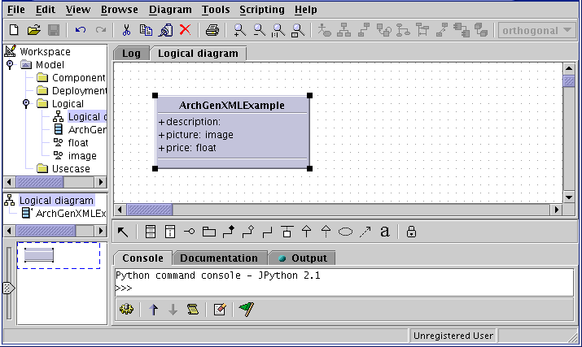
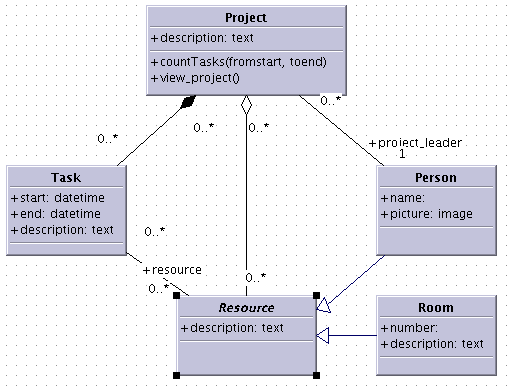
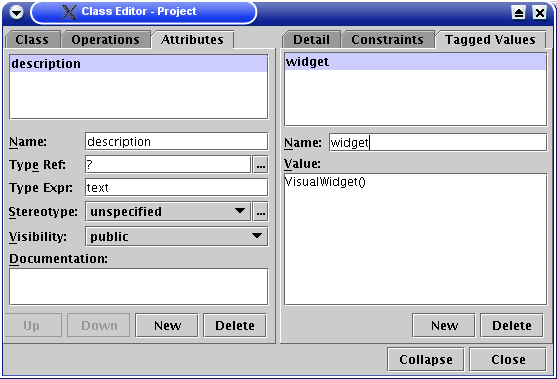
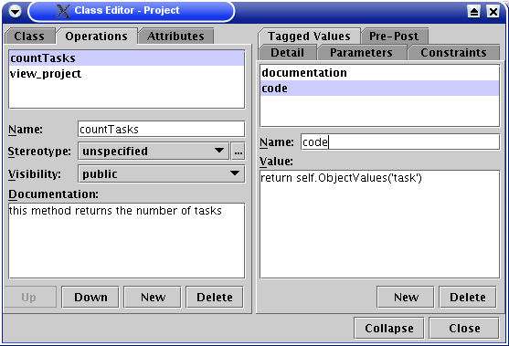
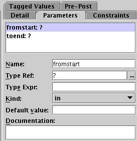
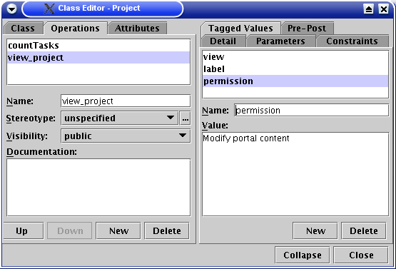
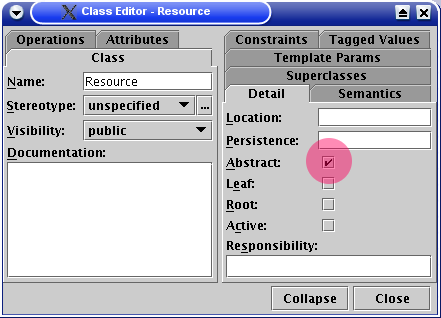

---------------------------------------------------
ArchGenXML Manual - generating Archetypes using UML
---------------------------------------------------


:Author ArchGenXML: Phil Auersperg <phil@bluedynamics.org>
:Author Documentation: Jens W. Klein <jens.klein@jensquadrat.de>
:Date: $Date: 2004/04/21 09:36:04 $
:Doku-Version: 1.0.1
:Web site: http://sourceforge.net/projects/archetypes
:Original URL: http://plone.org/documentation/archetypes/archgenxml-manual/


Introduction
============

ArchGenXML is a commandline utility that generates Plone applications (products)
based on the Archetypes framework from UML models using XMI (.xmi, .zargo, .zuml) and XSD (XMLSchema) files.

Design your Archetypes (code for content objects in plone) offline using a UML design tool
like Poseidon or ObjectDomain. Export the UML to XMI or XSD and use ArchGenXML to generate
Phyton code for use as a Product. This new Product is available as a new item (document) type
in the Plone userinterface.

This time the tool is not round-trip enabled: Generated code can't be back-converted into XMI.
But you can re-generate over existing code: The Method bodys are kept.

UML class diagramm - a brief introduction
=========================================

UML - the Unified Modelling Language is a graphical language designed to describe software.
To attain that goal this language has got several different diagram-types defined.
An overview about them gives the OOSE_ (german and a english pdf).
Our interest is mainly on class diagrams.
An article about class diagrams is at `Developer.com`_
and another comprehensive site about it you'll find at `The Official Agile Modeling (AM) Site`_.
The major resource for UML is `uml.org`_ the offical UML (tm) Resource Page of OMG.

.. _`uml.org`: http://www.uml.org/
.. _OOSE:           http://www.oose.de/notationuml14/
.. _`Developer.com`:  http://www.developer.com/design/article.php/2206791
.. _`The Official Agile Modeling (AM) Site`: http://www.agilemodeling.com/artifacts/classDiagram.htm

For ArchGenXML are from interest: the class-diagramm and it's different associations.
In future versions of ArchGenXML it may be possible to define the workflow with state diagrams.

With this language you're able to define object-oriented data-models.
A class is the outline of an object like a building-plan. With ArchGenXML you define this plan.
If a building is related to other building you define this with associations.

Getting started
===============

UML Tools
---------

ArchGenXML is tested with the XMI output from the following tools:

ObjectDomain_ (commercial, free demo for <= 30 classes)
    provides the possibility to export the model to XMI

Sybase Powerdesigner_ (commercial, demo download)
    supports model export as XMI (XMI version 1.1)

ArgoUML_ (free)
    stores the model native as xmi + diagram information in .zargo files (zip files) (xmi version 1.0)

Poseidon_  (commercial, based on ArgoUML)
    stores the model native as xmi + diagram information in .zuml files (zip files) (xmi version 1.2)

KDE_'s Umbrello_  (free, not complete yet)
    umbrello saves the models native in XMI (not fully standard compliant)

.. _ObjectDomain:   http://www.objectdomain.com/_odR30/odR3download.html
.. _Powerdesigner:  http://www.sybase.com/
.. _ArgoUML:        http://argouml.tigris.org/
.. _Poseidon:       http://www.gentleware.com/
.. _KDE:            http://www.kde.org/
.. _Umbrello:       http://www.umbrello.org/


Installation
------------
Requirements: You need an recent Archetypes with all it's dependencies (see Archetypes README) and PyXML_ for older Python versions.

It's tested with Plone 2.0.x and Archetypes 1.2.x and later

Install an UML-Tool on your local workstation.
For our examples we used the ObjectDomain Evaluation Version.
At the moment we tend to commend Poseidon CE.

Get latest `ArchGenXML Release`_ or grab the latest developer sketch from CVS::

    cvs -d :pserver:anonymous@cvs.sf.net:/cvsroot/archetypes co ArchGenXML

.. _`ArchGenXML Release`: http://sourceforge.net/project/showfiles.php?group_id=75272&package_id=103241

See also README file in ArchGenXML!

.. _PyXML:       http://pyxml.sourceforge.net/

Usage
-----

The usage is::

  python ArchGenXML.py -o <target> [ options ] <xmi-source-file>

  OPTIONS:
    -o <target>
        Output file directory path for data  representation classes. Last part
        is used for internal directory namings.

    -P <name1>,<name2>...
        names of packages to parse in source file

    -a --actions
        generates actions (default)

    --no-actions
        do not generates actions

    --method-preservation
        methods in the target sources will be preserved (default)

    --no-method-preservation
        methods in the target sources will be preserved

    -t --unknown-types-as-string
        unknown attribute types will be treated as text

    --ape-support
        generate apeconf.xml and generators for ape (needs Archetypes 1.1+)

    --i18n-support
        support for i18NArchetypes. Attributes with a stereotype 'i18n' or a
        taggedValue 'i18n' set to '1' are multilingual.

    --creation-permission=<perm>
        specifies which permission to create content default:Add [project]
        content

    --detailled-creation-permissions
        seperate creation permissions per class

    --no-module-info-header
        do not generate module info header

    --author=<string>
        set default author string for module info headers, taggedValue will
        override this

    --e-mail=<string>
        set default e-mail adress string for module info headers, taggedValue
        will override this

    --copyright=<string>
        set default copyright string for module info headers, taggedValue will
        override this

    --licence=<string>
        set default licence string for module info-headers, taggedValue will
        override this

Example::

    ./ArchGenXML.py -o MyNewProduct mynewproduct.xmi


First simple example
--------------------

First we start with a simple example describing how to generat your first simple
ArcheType out of an UML. Create a new class diagram. Create a new class.
Add some attributes.
No assigned value defaults to a string-field.
The example also has an image-field and field containing a floating-point number.



You can download this example here as XMI-File_ or ObjectDomain-File_.

.. _XMI-File: samples/ArchGenSimpleExample.xmi
.. _ObjectDomain-File: samples/ArchGenSimpleExample.odm

Now export it to XMI or .zargo.

Start ArchGenXML generating python code::

    ./ArchGenXML.py -a yes -o ArchGenSimpleExample ArchGenSimpleExample.xmi

Now a folder exists containing the Product. Move or link this Folder to your zope-instance product directory.
Restart zope. Go to to the portal_quickinstaller tool and add the new Product ArchGenSimpleExample. Thats it.
Now you have a new content-type available to your Plone.

ArchGenXML Cookbook
===================

A complex example using all ArchGenXML capabilities to show what is possible.

Overview
--------



Here we have a simple project-management software. The Class Project

Explaining Class ``Project``
----------------------------

We have a class Project with a field (attribute) description with the Type Expression ``text``.
It's rendered by default with the TextAreaWidget. But if you want to use Epoz,
VisualEditor or such nice stuff we have to change it to the VisualWidget.
Create a new tagged value called ``widget`` and give it the value ``VisualWidget``.



We also define some operations. First a simple method: ``countTasks``.
It contains its code as an tagged value ``code``. You can add some ``documentation`` too.
It's written to the method code too.



You can also define the parameters given to the method in UML:



Also it's possible to define views for the ArcheType. An ``operation`` having the ``tagged value`` ``view`` generates an action.



Inheritance
-----------

The Class ``Resource`` is marked as abstract and the Classes ``Person``, ``Room`` are inherited from it.
It means ``Resource`` isn't an addable object. It is just used to inherit from.  Person and Room are getting a field ``description``.



The arrows indicating the inheritance are placed by selecting the Generelization Tool and drag from ``Person`` or ``Room`` to ``Resource`` (see figure overview above).


References
----------

By defining references you get a field to select a referenced class.
Referenced objects can be moved inside the site and references still working.

Multiplicity
------------

You can define the Multiplicity of aggregated and referenced classes.

The following multiplicity is supported:

- 0 .. N
- 1 .. 1
- 1 .. N

N - N is not supported.


ArchGenXML Reference
====================

Installation Procedure
----------------------

Instead of editing 'Extensions/Install.py' you should place a new file 'AppInstall.py'.
Define one or both  methods out of 'install' and 'uninstall' and put you additional code in here.
They are called after the automatic installation process via 'CMFQuickInstallerTool' (or old school style: calling External methods).

Classes in General
------------------

Stereotypes
```````````

no stereotype defined
    Generate a simple standard Archetype.

stub, odStub
    Classes with one of this stereotypes are ignored in generation process.

portal_tool
    If defined the Archetype behaves like a portal_tool.

Tagged Values
`````````````

Tagged Values are used to add different behaviors to a class:

archetype_name
    This name appears in the 'add new item' box.
    Default to class name.

additional_parents
    parent classes for the class, comma-delimited.

author
    set author name for module header info. defaults to 'unknown'.
    Default may be changed by command line parameter.

autoinstall
    If set to '1' a portal_tool instance will be created while installing the Product.
    Only in combination with stereotype 'portal_tool'.

base_actions
    Defines an actions tuple. Normally only used to inherit tuples from base_class.
    If you just want define own actions see section 'Methods/Operations/Actions of a Class'.

base_class
    Defines the base-class for folderish or contentish classes.
    If no aggregation to another class is defined it defaults to 'BaseContent' otherwise to 'Basefolder'.
    If i18n-support is enabled it defaults to 'i18nBaseContent' resp. to 'i18nBaseFolder'.

base_schema
    Defines an alternate base-schema for the class instead of 'BaseSchema' or 'I18NBaseSchema'.
    Do not forget to import your schema (see imports).

class_header
    Code in here appears in the header of the class.

configlet
    If set to '1' the 'view' action of the portal_tool will be used as a configlet.
    Defaults to '0'.
    Only in combination with stereotype 'portal_tool' and tagged value autoinstall set.

configlet_condition
    Conditon expression for configlet.
    Defaults to empty string.
    Only in combination with configlet.

configlet_description
    Description of the configlet.
    Defaults to 'ArchGenXML generated Configlet configlet_title in Tool classname'.
    Only in combination with configlet.

configlet_icon
    Icon used for configlet.
    Defaults to 'plone_icon'.
    Only in combination with configlet.

configlet_section
    Section where configlet should appear. One out of 'Plone', 'Product' or 'Member'
    Defaults to 'Product'.
    Only in combination with configlet.

configlet_title
    Title of portal_tool and configlet.
    Defaults to the class name.
    Only in combination with configlet.

configlet_view
    View which is shown for configlet
    Defaults to the '/'.
    Only in combination with configlet.

content_icon
    set image name used as icon for the content type.
    Defaults to 'classname.gif' with classname as the replaced by the name of the class.
    Affects fti.

copyright
    set copyright message for module header info. defaults to 'unknown'.
    Default may be changed by command line parameter.

default_actions
    Generate default actions for this class.
    Can be enabled globally via command line parameter too.
    Is only neccessary for Archetypes versions less than 1.2!

email
    set email-address for module header info. defaults to 'unknown'.
    Default may be changed by command line parameter.

hide_actions
    Modify fti and set 'visible=0' on actions listed here.
    One action per line.
    I.e. to disable 'properties'-tab put 'metadata' in here.
    Does not work for global folder tabs (Plone specific). See tagged value 'hide_folder_tabs'

hide_folder_tabs
    Default is to global show the defined folder tabs (plone specific). This is i.e. the tab 'contents'
    Setting 'hide_folder_tabs=1' do not add this content-type to
    'YOUR_SITE/portal_properties/site_properties' property 'use_folder_tabs' while installing.

immediate_view
    Defines the immediate view in the fti. Defaults to 'base_view'.

imports
    Additional import lines. Code in here appears in the header of the file.

licence
    set licence for module header info. Defaults to 'GNU General Public Licence (GPL) Version 2 or later'.
    Default may be changed by command line parameter.

marshaller
    marshaller to be used within Schema.


misc
````

abstract
    Setting 'abstract' to checked (true, 1): The class is not available as Plone Content.
    Other classes can inherit from it.

Attributes of a Class
---------------------

For tagged values starting with 'python:' the code after ':' is taken, otherwise a triple quoted string.


Stereotypes
```````````

i18n
    Support for i18NArchetypes. Fields with stereotype i18n are multilingual.

Expressions
```````````

A list of all possible expressions for attributes and it's default settings.

string
    - StringField
    - searchable=1

text
    - StringField
    - searchable=1
    - TextAreaWidget()

integer
    - IntegerField
    - searchable=1

float
    - FloatField
    - searchable=1

boolean
    - BooleanField
    - searchable=1

lines
    - LinesField
    - searchable=1

date
    - DateTimeField
    - searchable=1

image
    - ImageField
    - sizes={'small':(100,100),'medium':(200,200),'large':(600,600)}
    - AttributeStorage()

file
    - FileField
    - AttributeStorage()
    - FileWidget()

lines
    - LinesField
    - searchable=1

Tagged Values
`````````````

All tagged values of a attribute will be converted into extended attributes for the archetypes field;
i.e. you can define 'widget', 'storage', searchable, ... to overwrite defaults or set additional.


Use of tagged value 'widget':
    - 'widget' defines the whole widget.
    - 'widget:KEY' defines one key added to the widget.
    - i.e. 'widget:label' with content 'python:'Name' or 'widget:description' with content 'Enter your name'.

At tagged value i18n on an attribute have the same effect as stereotype i18n.

Methods/Operations/Actions of a Class
-------------------------------------

Methods are generated from UML-Code if you want that.
You can also generate over an existing Python-File and ArchGenXML will keep the code of existing methods untouched.

Actions are generated by default you can turn it off by running ArchGenXML with parameter --no-actions.
You can define all nessecary values via ArchGenXML.

Stereotypes
```````````
no stereotype defined
    Generate a method.

action
    Generate an general action.

view
    Generate an action and copy empty page-template to skins directory named like the form + .pt if no such template exists.

form
    Generate an action and copy empty form-controller template to skins directory named like the form + .cpt if no such template exists.


Parameters
``````````

Defines parameters of the method. Unused for action, view or form.

If 'action name' below is mentioned it is the name of the method with
stereotype action, view or form unless no tagged value 'action', 'view'
or 'form' is defined (depending on the stereotype).

Tagged Values
`````````````

action
    The action to be executed. Defaults to action name.

code
    The python code-body of your method.

category
    The category of an action, view or form. Defaults to 'object'.

documentation
    The python doc-string of a method.

form
    see action. an empty template with

id
    The id of an action, view or form. Defaults to the action name.

label
    The label of an action, view or form. Defaults to the action name.

permission
    Set permission for:

    method
        permission='MY_PERMISSION' results in security.declareProtected('MY_PERMISSION','mymethodname')

    action
        permission='MY_PERMISSION' results in 'permissions': ('MY_PERMISSION',)

view
    see action


Aggregation between two classes
-------------------------------

By defining an aggregation your archetype will become folderish.
Only aggregated objects are allowed to residate in the folder.

There are two types of aggregation with different behaviors:

shared aggregation (empty rhomb)
    aggregated objects are allowed to be added outside and inside the archetype

composite aggregation  (filled rhomb)
    aggregated objects are only allowed to reside inside the archetype

